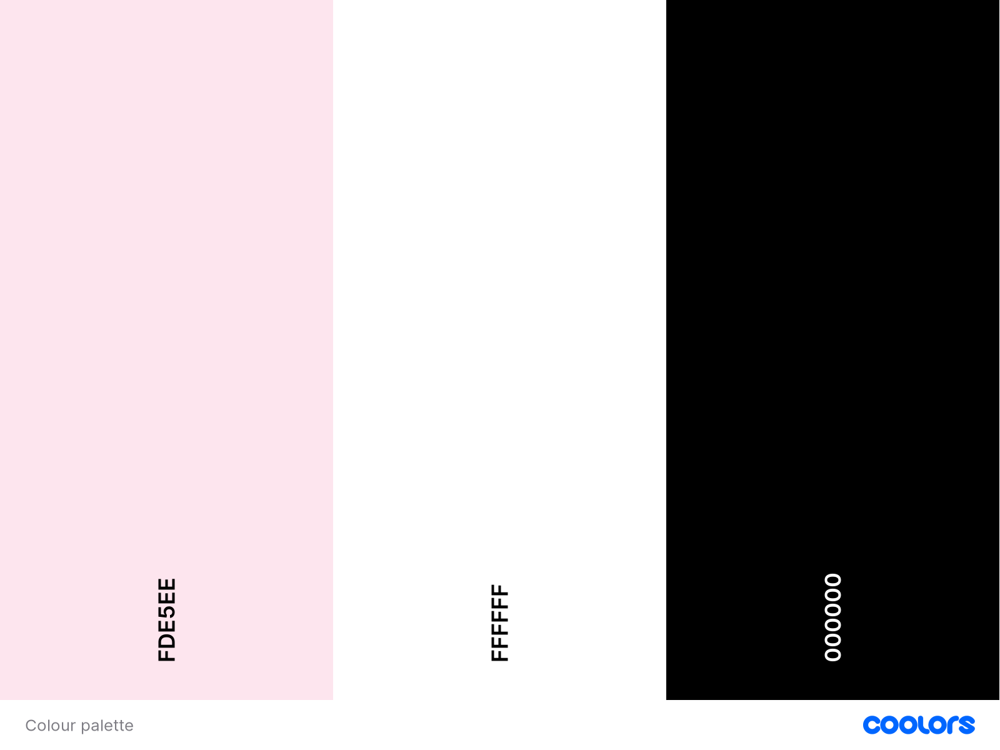
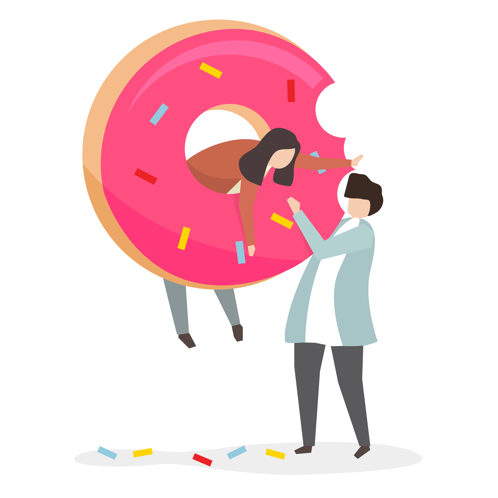
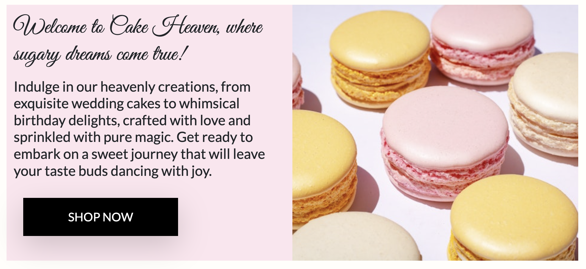
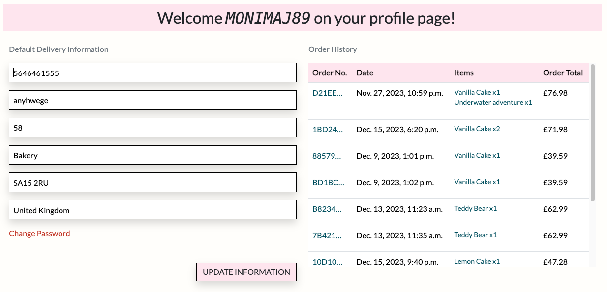

# Cake Heaven

Cake heaven is a e-commerce website project created for a imaginary bake shop in UK. The main goal of this project was to create the most user-friendly website possible, where you can shop for cakes in an easy and intuitive way. 
The user can browse products, add them to the cart, and make a payment. The user can make a purchase as a registered user or as a guest. Registered users also have the option to view their order history and leave reviews about products.

Project was created using Python, Django, HTML5, CSS3, and JavaScript. The data was stored in a PostgreSQL database using ElephantSql for manipulation. Cake Heaven is my fourth and last milestone project for Code Institute's Level 5 Diploma in Web Application Development.

[View the live site](https://cake-heaven-8414245a4be7.herokuapp.com/)

# UX and Five Planes of Website Design

## Strategy

### User stories

1. As a first time user I want to:
* Immediately understand the main purpose and use of the site
* Be able easily navigate through the page
* Be able search for the products on the page
* Contact the company with any queries 
* Buy prodcts without registration
* See the reviews left by other users
* Be able use the page on any devices and size screens
* Login/ create an user account

2. As a registered user I want to:
* Have access to my profile page
* Be able to leave the products reviews
* See my order history 
* Be able to update and save my personal info
* Make purchase with my delivery info always filled

3. As an admin I want to:
* Be able to add, edit and delete products
* View and manage customer reviews
* Delete customer review if not appropriate
* Have easy acces to admin controls

## Scope

1. When planning the App features and scope, I drew up an Importance Viability analysis of these features, please see below:

| Feature                          | Importance | Difficulty |
|-----------------------------|------------|------------|
| Responsive design                | 5          | 1          |
| Navigation through page              | 5          | 1          |
| Search function              | 4          | 3          |
| Welcome text                   | 4          | 1          |
| Shop Now button               | 4          | 1          |
| Featured products            | 3          | 3          |
| Contact Form            | 4          | 4          |
| Social links              | 2          | 1          |
| Products page           | 5          | 3          |
| Sorting products            | 4          | 4          |
| Products detail card            | 5          | 4          |
| Select quantity                 | 5          | 4          |
| Add to bag function          |5      |3         |
| CRUD Functionality for admin        | 5          | 3          |
| User reviews           | 3          | 4          |
| Review management for admin      | 5          | 2          |
| Checkout page                | 5          | 4          |
| Secure payment system          |5      |5         |
| Order summary on succesful purchase       | 3          | 3          |
| Register/Login functionality          | 5         | 4          |
| User's profile page with order history         | 5          | 3          |
| Update user's info         | 5          | 4          |

2. Future features - There are also a number of features I would like to implement to the page in the future:
* Live chat
* Order Tracking
* Discount vouchers
* User's wishlist

## Structure

The website structure is divided into many separate pages that are displayed depending on the type of user. The details are displayed on flow diagram below build using [Lucidchart](https://www.lucidchart.com/pages/)
 

## Skeleton

1. Database Schema
During the planning phase, a crucial step involved constructing a well-defined database schema to facilitate the development process. To visually represent the database, I used [DrawSQL](https://drawsql.app/), which proved to be a valuable tool throughout the development journey. The site uses a relational database model using Postgres (Elephant SQL). Several models were adapted from the Boutique Ado walkthrough (User, Email, UserProfile, Category, and Product). Additionally, two original models were introduced, Contact form and Product review.

2. Wireframes

The wireframes were created using [Balsamiq](https://balsamiq.com/).

**Desktop**

Home Page

Products Page

Profile Page

Contact Form

 

**Tablet**

Home Page

Profile Page

Contact Form

 

**Mobile**

Home Page

Product Page

Profile Page

Contact Form

## Surface

[Bootstrap](https://getbootstrap.com/) was used and customised for the front-end development

### Colour
The colors used on my website are simple. I decided on a white background with pink accents to emphasize the sweetness of the page

Additionally, four colors were used for danger/warning/success/info features

### Typography
Fonts was imported from [Google Fonts](https://fonts.google.com/)
* Great Vibes has been used as a welcome header on home page

* Lato has been used as a main body font

* Sans serif is set as a backup if any of the fonts fail to load

### Images and icons

All images are fully credited [here](#credits)

* Favicon - borrowed from [Here](https://favicon.io/)

* 404 error page borrowed from rawpixel.com on [Freepik](https://www.freepik.com/)

# Features

## Home Page

  * Animated banner - located at the top of the page, an animated banner informs the user about free delivery and the deadline for ordering next day delivery

  

  

  * Logo, Search Bar, account icon and shopping Bag - Logo is a simple company name, using search bar user can search for his favoutire flavours. Through 'My Account' user can register or login, already logged in user can also go to his profile page, for admin there is also management page. Shopping bag change the icon when full

  
  

  * Main navbar - User can choose his favourite cakes using dropdown menu with categories

  

  * Welcome Banner - Main banner with welcome text, an image and Shop now button, which directs to all products page

  

  * Featured cakes - a gallery with our featured cakes

  

  * Footer - contains general info about our bakery, contact us form, bakery address and social links. On the bottom there is a copyright info

  

## Products Page 
Contains all products within all categories. On the top user can sort and filter according to name, category, price and rating

  * Product detail - a separate card with all product's details as a name, price, rating, description with ingredients and quantity

  

  * Reviews - Below the detail card user can see all the review from other users, and logged in user can add his own review

  

  * Go Back/Add to Bag Buttons - Buttons to go back to products page, or to add product to the bag

  

## Shopping Bag

  * Empty Bag - if the bag remains empty, user can only see a button to keep shopping which directs to products page

  

  * Bag with product - contains summary of order with update quantity function and delete products function. Below summary there is a total of all products with info how much more user can spend for free delivery

  

  * Buttons - Keep shopping button to go back to product page and Secure Checkout button for checkout

  

## Checkout 
Guest user can fill his details in the form provided, which can be already saved for logged in users. Checkout page also contains order summary with all product details

  * Contact form link - Directs to contac form page, where user can send all inquiries

  * Card detail box - a simple payment form using Stripe for secure and easy purchase

  * Buttons - Go back to bag button, to see user's bag, and Place order, with warning info about the amount being charged

  

  * Checkout Process - after order being placed user see a loading spin page, and then the stripe window to confirm payment

  

  * Success Page - after order being placed and payment confirmed user is directed to the success checkout page with order and details summary. User gets a confirmation email on his address

## Profile Page 
Any logged in user has access to his profile page which contains:

  * Personal info details - phone number and address which can be updated
  * Order history with order number which directs to order summary page

## Management Site 
Form created for admin to easy add product to the page

## Contact Form 
A form connected with company email address for user to easy and fast contact

  * Thank you page - after sending the inquiry user is directed into Thank you page saying that company will contact back as soon as possible

  

## Authentication

The project uses AllAuth to implement User login and authentication functionality. AllAuth comes with a whole load of backend functionality and front end templates that make the user, registration, sign in/out and user management easy and quick to create

Main templates provided by AllAuth:

  * Register - function provided straight from an account navbar, allows for new user to register on a page, contains a 'sign-in' link for already registered users. Successfully registered user receives a confirmation email with verification code
  * Sign In - For already registered users, accessible from an account navbar, contains a 'register' link for new users. User can sign in using Username or email, and tick the box to remember him. Page also contains a "Forgot password" link if user can not log in
  * Sign Out - Accessible from an account navbar, redirects to page where user can confirm if ready to log out. After signing out the bag contect is removed from the session.
  * Forgot password - Available for already registered user on 'sign in' page, required an email address existing in database. Send an email with password reset link, where user is able to reset his password and login again.

## Error Page 
A 404 error page created for a positive user experiance when lost on non-existent page, with button to quick get back to home page

  

## Note
* Commit from 8 Nov - Site Deployment - An accidentally committed piece of code that should not had been committed at this stage. The committing concerned only site deployment, and the code from the products/views.py had not been plan to commited yet.
* Credentials exposed - My AWS access and secret keys had been committed and pushed before I manage to hide them. Both keys were generated once again and switched.