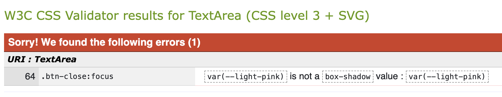

# Cake Heaven - Testing

This is the testing documentation for my web application Cake heaven. Full [README available here](/README.md)

See the live site [here](https://cake-heaven-8414245a4be7.herokuapp.com/).3

# Validation 
## HTML Validation
The initial test of the page validated by URL using [W3C HTML Validator](https://validator.w3.org/#validate_by_uri) showed couple of errors:
| **Feature**| **Result** | **Pass/Fail** |
| :--- | :--- | :--- |
| HOME | Double ID attributes on Account dropdown menu - as there is a seperate dropdown menu for desktop and mobile devices, I've change the name of id for mobile devices  | Pass |
| PRODUCT DETAILS | 'li' element as a 'div' child - In ingredients list, changed the 'div' element for an 'ul' element | Pass
| ADD PRODUCT | 1. Delete 'type="text/javascript' from the 'script' tag as it isn't neccessary. 2. Delete 'strong' element from around 'p' element as paragrapf can't be a direct child of a 'strong' element. 3. Double 'id' attribute for image selection in the custom_clearable_file_input - changed JavaScript 'id' for a 'class' and remove 'class' from forms.py to avoid double class error.  | Pass |
| EDIT PRODUCT | Add an 'alt' attribute to an image in custom_clearable_file_input | Pass |
| CHECKOUT | Empty heading tag - a loading spinner was inside 'h1' tags for a bigger font, but instead I've changed the 'h1' to a 'div' element and add the class with font size | Pass |

I have attached only one screenshot of the test results because they all look identical on every page

Final result

## CSS Validation
I run the CSS code through [W3C CSS Validator](https://jigsaw.w3.org/css-validator/#validate_by_input) and showed one error and couple of warnings

### Error

* Error regards styling on focus effect of Close cross button on modal window, and I've decided to delete the focus styling entirely as it was not necessary at the first place

Css Error

### Warnings

* Imported style sheets - This refers to Google's font import, and aa it is a standard way to import fonts directly in to the CSS, I've decided to ignore thatw arning
* Vendor extension error - there is nothing to do about this since those extensions help support browser compatibility efforts 
* Same color for background-color and border-color - necessary action to override Bootstrap styling

Css Warnings

## JavaScript Linting
I ran the JavaScript code through [JSHint](https://jshint.com/), which only showed one missing colon, which was easy to fix, and undeclared variable on stripe_payment.js, which is declared somewhere else

### Results presented below

stripe_element.js

country_field.js

quantity_input.js (Bag, Product page)

scroll_top.js

sort_box.js

Add image input

Update/Remove (Bag)

